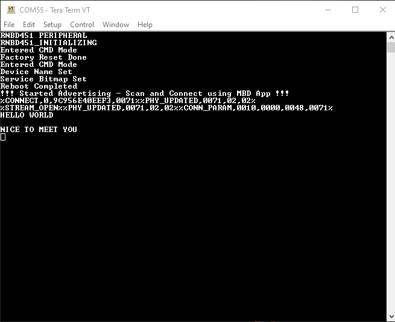

# Microchip RNBD451 Arduino Library

> "IoT Made Easy!" 

Devices: **| RNBD451 | ARDUINO ZERO | SAMD21 |** 
Features: **| BLE |**

## ⚠ Disclaimer

<b>
THE SOFTWARE ARE PROVIDED "AS IS" AND GIVE A PATH FOR SELF-SUPPORT AND SELF-MAINTENANCE. This repository contains example code intended to help accelerate client product development.  

For additional Microchip repos, see: <a href="https://github.com/Microchip-MPLAB-Harmony" target="_blank">https://github.com/Microchip-MPLAB-Harmony</a>

Checkout the <a href="https://microchipsupport.force.com/s/" target="_blank">Technical support portal</a> to access our knowledge base, community forums or submit support ticket requests.

</b>

## Contents

1. [Introduction](#step1)
1. [Bill of materials](#step2)
1. [Software Setup](#step3)
1. [Hardware Setup](#step4)
1. [Board Programming](#step5)

## 1. Introduction<a name="step1">

This is a Arduino library for using the Microchip RNBD451 BLE module with Arduino Zero Board. This has two arduino example projects as shown below.

### Example 1: BLE UART

This BLE UART example Initializes the RNBD451 and starts advertising. The user can scan and connect through MBD App for data transfer via Transparent UART Service.

### Example 2: CENTRAL & PERIPHERAL

This application has two example CENTRAL and PERIPHERAL. The central device scans frequently for the peripheral device and gets connected to it. The user can exchange data between both device via serial port 

## 2. Bill of materials<a name="step2">

| TOOLS | QUANTITY |
| :- | :- |
| [RNBD451 Add On Board](https://www.microchip.com/en-us/development-tool/ev25f14a#:~:text=The%20RNBD451%20Add%20On%20Board,%E2%84%A2%20Add%20On%20Bus%20Standard.) | 2 |
| [Arduino UNO click shield](https://www.mikroe.com/arduino-uno-click-shield) | 2 |
| [Arduino Zero](https://store-usa.arduino.cc/products/arduino-zero) | 2 |

## 3. Software Setup<a name="step3">

- [Arduino IDE 2.2.1](https://www.arduino.cc/en/software)

## 4. Hardware Setup<a name="step4">

- Connect the RNBD451 Module to the Mikro BUS 1 of the Arduino UNO click SHIELD as shown below.

## 5. Board Programming<a name="step5">

- Download the ZIP file of this repository and add it to your [Arduino .ZIP Library](https://docs.arduino.cc/software/ide-v1/tutorials/installing-libraries#importing-a-zip-library) as shown below.

- Open the example sketch for programming the board.

- Select the programming port and upload the sketch.

### Example 1: BLE UART

### Example 2: CENTRAL & PERIPHERAL

#### CENTRAL:

#### PERIPHERAL:

## License

	(c) 2023 Microchip Technology Inc. and its subsidiaries. 
    
    Subject to your compliance with these terms, you may use Microchip software and any 
    derivatives exclusively with Microchip products. It is your responsibility to comply with third party 
    license terms applicable to your use of third party software (including open source software) that 
    may accompany Microchip software.
    
    THIS SOFTWARE IS SUPPLIED BY MICROCHIP "AS IS". NO WARRANTIES, WHETHER 
    EXPRESS, IMPLIED OR STATUTORY, APPLY TO THIS SOFTWARE, INCLUDING ANY 
    IMPLIED WARRANTIES OF NON-INFRINGEMENT, MERCHANTABILITY, AND FITNESS 
    FOR A PARTICULAR PURPOSE.
    
    IN NO EVENT WILL MICROCHIP BE LIABLE FOR ANY INDIRECT, SPECIAL, PUNITIVE, 
    INCIDENTAL OR CONSEQUENTIAL LOSS, DAMAGE, COST OR EXPENSE OF ANY KIND 
    WHATSOEVER RELATED TO THE SOFTWARE, HOWEVER CAUSED, EVEN IF MICROCHIP 
    HAS BEEN ADVISED OF THE POSSIBILITY OR THE DAMAGES ARE FORESEEABLE. TO 
    THE FULLEST EXTENT ALLOWED BY LAW, MICROCHIP'S TOTAL LIABILITY ON ALL 
    CLAIMS IN ANY WAY RELATED TO THIS SOFTWARE WILL NOT EXCEED THE AMOUNT 
    OF FEES, IF ANY, THAT YOU HAVE PAID DIRECTLY TO MICROCHIP FOR THIS 
    SOFTWARE.

